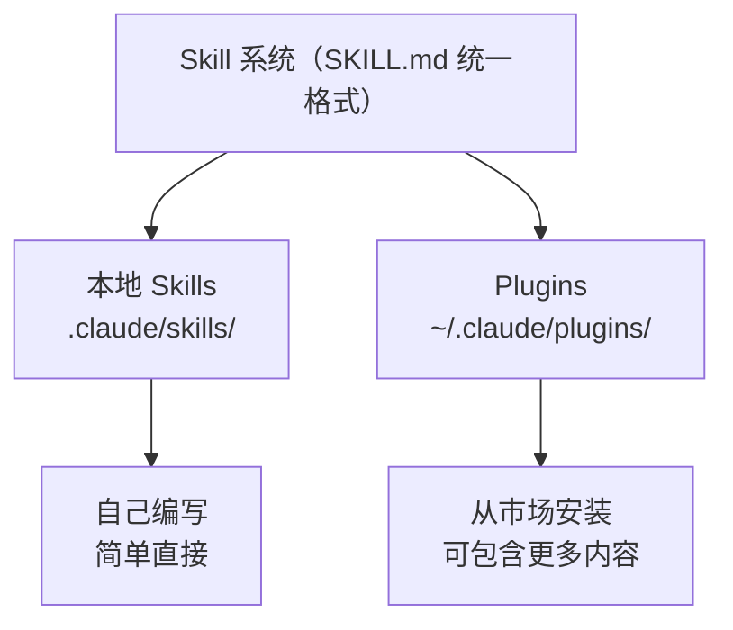

# Claude Code Skills 学习笔记

## 目录

- [1. 概述](#1-概述)
- [2. 快速入门](#2-快速入门)
- [3. Skill 的存储位置与作用范围](#3-skill-的存储位置与作用范围)
- [4. User Skills 与 Plugin Skills](#4-user-skills-与-plugin-skills)
  - [4.1 核心区别](#41-核心区别)
  - [4.2 目录结构](#42-目录结构)
  - [4.3 两者的关系](#43-两者的关系)
  - [4.4 实际案例](#44-实际案例)
- [5. 参考链接](#5-参考链接)

---

## 1. 概述

1. **Skill 的本质是 Prompt-as-Program**：不管是本地 Skill 还是 Plugin Skill，核心都是一个 SKILL.md 文件——用 Markdown 写的「程序」，Claude 是「解释器」。
2. **Plugin 是 Skill 的分发层**：就像 npm package 之于 JavaScript 文件，Plugin 给 Skill 加上了版本管理、远程安装、命名空间等分发能力。

## 2. 快速入门

### 创建你的第一个 Skill

**Step 1：创建 Skill 目录**

```bash
mkdir -p ~/.claude/skills/explain-code
```

**Step 2：编写 SKILL.md**

每个 Skill 都需要一个 SKILL.md 文件，包含两部分：**YAML frontmatter**（告诉 Claude 何时使用该 Skill）和 **Markdown 指令**（Claude 调用 Skill 时遵循的说明）。

```yaml
---
name: explain-code
description: Explains code with visual diagrams and analogies. Use when explaining how code works, teaching about a codebase, or when the user asks "how does this work?"
---

When explaining code, always include:

1. **Start with an analogy**: Compare the code to something from everyday life
2. **Draw a diagram**: Use ASCII art to show the flow, structure, or relationships
3. **Walk through the code**: Explain step-by-step what happens
4. **Highlight a gotcha**: What's a common mistake or misconception?

Keep explanations conversational. For complex concepts, use multiple analogies.
```

> **提示**：若 Skill 未被正确加载，可尝试重启终端会话。可以使用 `/context` 命令查看当前上下文中有哪些技能被加载了。

## 3. Skill 的存储位置与作用范围

| 位置 | 路径 | 适用于 |
| --- | --- | --- |
| 企业 | 参阅托管设置 | 你的组织中的所有用户 |
| 个人 | `~/.claude/skills/<skill-name>/SKILL.md` | 你的所有项目 |
| 项目 | `.claude/skills/<skill-name>/SKILL.md` | 仅此项目 |
| 插件 | `<plugin>/skills/<skill-name>/SKILL.md` | 启用插件的位置 |

## 4. User Skills 与 Plugin Skills

### 4.1 核心区别

| 维度 | User Skill（用户技能） | Plugin Skill（插件技能） |
| --- | --- | --- |
| 创建方式 | 手动创建文件 | `/plugin` 安装 |
| 调用方式 | `/skill-name` | `/plugin-name:skill-name` |
| 存储位置 | `.claude/skills/` 或 `~/.claude/skills/` | `~/.claude/plugins/cache/` |
| 共享方式 | git commit 到项目 | 发布到 GitHub Marketplace |
| 适合场景 | 团队内部工作流、个人习惯 | 社区通用工具、复杂工作流 |

两类技能都支持斜杠命令触发，也都可以由 Claude 根据用户意图自动识别调用。

`/context` 输出中可以看到两类技能的分类：

```text
Skills · /skills
User                          ← 用户技能
└ explain-code
└ plannotator-review

Plugin                        ← 插件技能
└ baoyu-xhs-images
└ baoyu-cover-image
└ ...
```

### 4.2 目录结构

**本地 Skills（`.claude/skills/`）**

Claude Code 原生的 Skill 系统，在项目目录中手动创建：

```text
.claude/skills/
└── my-skill/
    └── SKILL.md      ← 手写的 Skill 定义文件
```

特点：
- 直接在项目目录中创建，简单轻量
- 适合个人或团队自用的工作流
- 放在 `~/.claude/skills/` 全局生效，`.claude/skills/` 项目级别生效

**Plugins（`~/.claude/plugins/`）**

Claude Code 的插件分发系统，通过 `/plugin` 命令从 GitHub 市场安装：

```text
~/.claude/plugins/
├── known_marketplaces.json     ← 注册的市场（GitHub 仓库）
├── installed_plugins.json      ← 已安装的插件列表
└── cache/
    └── baoyu-skills/
        └── content-skills/
            └── skills/
                └── baoyu-xhs-images/
                    └── SKILL.md    ← 和本地 Skill 格式完全一样
```

特点：
- 从远程 GitHub 仓库安装
- 适合社区共享和分发
- 可以包含多个 Skills + Scripts + Hooks + MCP Servers
- 通过 `plugin-name:skill-name` 命名空间避免冲突

### 4.3 两者的关系



底层格式完全一致——都是 SKILL.md 文件。Plugin 只是多了一层「打包和分发」的机制。

### 4.4 实际案例

以 `baoyu-skills` 为例：安装的 `content-skills` 来自 [JimLiu/baoyu-skills](https://github.com/JimLiu/baoyu-skills) 这个 GitHub 仓库，它包含了 15 个 Skills，打包成了一个 Plugin 来分发。如果作者只写一个 SKILL.md 放在博客上让你复制到 `.claude/skills/`，效果其实一样——只是没有自动安装、版本管理和依赖脚本的便利。

## 5. 参考链接

### 官方资源

- [Skills 官方文档](https://code.claude.com/docs/zh-CN/skills) — Skill 创建与配置的完整参考
- [功能概览](https://code.claude.com/docs/zh-CN/features-overview) — Claude Code 全部功能的概览
- [最佳实践：创建 Skills](https://code.claude.com/docs/zh-CN/best-practices#%E5%88%9B%E5%BB%BA-skills) — 编写高质量 Skill 的建议
- [官方技能仓库](https://github.com/anthropics/skills) — Anthropic 官方维护的 Skill 集合

### 社区资源

- [宝玉的 Skills](https://github.com/JimLiu/baoyu-skills/blob/main/README.zh.md) — 包含 15 个实用 Skill 的社区插件
- [宝玉的推文介绍](https://x.com/dotey/status/2014607139352859077) — Skills 使用心得分享
- [微信公众号文章](https://mp.weixin.qq.com/s/9F7XwoOMaAZkvj8gU4RJ9Q) — Skills 相关教程
- [宝玉的博客](https://baoyu.io/) — 更多 AI 工具使用技巧
- [通往 AGI 之路](https://waytoagi.feishu.cn/) — AI 学习资源汇总
