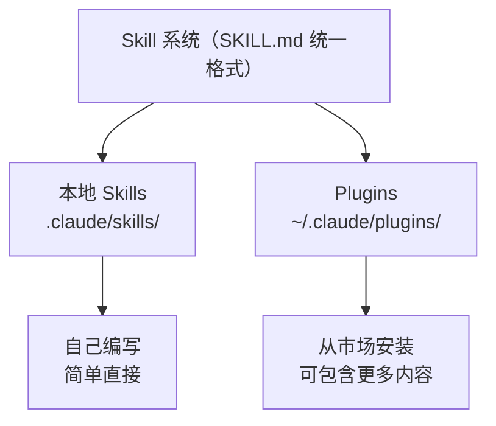

# Claude Code Skills 学习笔记

## 目录

- [Claude Code Skills 学习笔记](#claude-code-skills-学习笔记)
  - [目录](#目录)
  - [1. 概述](#1-概述)
  - [2. 快速入门](#2-快速入门)
    - [创建你的第一个 Skill](#创建你的第一个-skill)
  - [3. Skill 的存储位置与作用范围](#3-skill-的存储位置与作用范围)
  - [4. User Skills 与 Plugin Skills](#4-user-skills-与-plugin-skills)
    - [4.1 核心区别](#41-核心区别)
    - [4.2 目录结构](#42-目录结构)
    - [4.3 两者的关系](#43-两者的关系)
    - [4.4 实际案例](#44-实际案例)
    - [4.5 Skills 与 Plugin 的关闭管理](#45-skills-与-plugin-的关闭管理)
  - [5. SKILL.md 进阶写法](#5-skillmd-进阶写法)
    - [5.1 两种 Skill 架构模式](#51-两种-skill-架构模式)
    - [5.2 references/ 文件夹设计](#52-references-文件夹设计)
    - [5.3 多步骤工作流 + 确认点设计](#53-多步骤工作流--确认点设计)
    - [5.4 Skill 之间的调用关系](#54-skill-之间的调用关系)
    - [5.5 脚本集成（scripts/）](#55-脚本集成scripts)
    - [5.6 用户偏好系统（EXTEND.md）](#56-用户偏好系统extendmd)
    - [5.7 SKILL.md Frontmatter 字段全览](#57-skillmd-frontmatter-字段全览)
    - [5.8 Skill 参数传递（$ARGUMENTS）](#58-skill-参数传递arguments)
  - [6. 高阶写法](#6-高阶写法)
    - [6.1 动态上下文注入（!command）](#61-动态上下文注入command)
    - [6.2 在子代理中运行 Skill](#62-在子代理中运行-skill)
    - [6.3 控制 Claude 的 Skill 访问权限](#63-控制-claude-的-skill-访问权限)
    - [6.4 生成可视化输出](#64-生成可视化输出)
  - [7. 故障排除](#7-故障排除)
    - [Skill 未被触发](#skill-未被触发)
    - [Skill 误触发过于频繁](#skill-误触发过于频繁)
    - [Claude 看不到所有 Skills](#claude-看不到所有-skills)
  - [8. 参考链接](#8-参考链接)
    - [官方资源](#官方资源)
    - [社区资源](#社区资源)

---

## 1. 概述

1. **Skill 的本质是 Prompt-as-Program**：不管是本地 Skill 还是 Plugin Skill，核心都是一个 SKILL.md 文件——用 Markdown 写的「程序」，Claude 是「解释器」。
2. **Plugin 是 Skill 的分发层**：就像 npm package 之于 JavaScript 文件，Plugin 给 Skill 加上了版本管理、远程安装、命名空间等分发能力。
3. 将 SKILL.md 保持在 500 行以下
4. 要在 skill 中启用扩展思考，在你的 skill 内容中的任何地方包含单词”ultrathink”。

## 2. 快速入门

### 创建你的第一个 Skill

**Step 1：创建 Skill 目录**

```bash
mkdir -p ~/.claude/skills/explain-code
```

**Step 2：编写 SKILL.md**

每个 Skill 都需要一个 SKILL.md 文件，包含两部分：**YAML frontmatter**（告诉 Claude 何时使用该 Skill）和 **Markdown 指令**（Claude 调用 Skill 时遵循的说明）。

```markdown
---
name: explain-code
description: Explains code with visual diagrams and analogies. Use when explaining how code works, teaching about a codebase, or when the user asks "how does this work?"
---

When explaining code, always include:

1. **Start with an analogy**: Compare the code to something from everyday life
2. **Draw a diagram**: Use ASCII art to show the flow, structure, or relationships
3. **Walk through the code**: Explain step-by-step what happens
4. **Highlight a gotcha**: What's a common mistake or misconception?

Keep explanations conversational. For complex concepts, use multiple analogies.
```

> **提示**：若 Skill 未被正确加载，可尝试重启终端会话。可以使用 `/context` 命令查看当前上下文中有哪些技能被加载了。

## 3. Skill 的存储位置与作用范围

| 位置 | 路径 | 适用于 | 优先级 |
| --- | --- | --- | --- |
| 企业 | 参阅托管设置 | 你的组织中的所有用户 | 最高 |
| 个人 | `~/.claude/skills/<skill-name>/SKILL.md` | 你的所有项目 | 次之 |
| 项目 | `.claude/skills/<skill-name>/SKILL.md` | 仅此项目 | 再次 |
| 插件 | `<plugin>/skills/<skill-name>/SKILL.md` | 启用插件的位置 | 命名空间隔离 |

> 当不同层级存在同名 Skill 时，按 企业 > 个人 > 项目 的优先级生效。Plugin Skills 通过命名空间隔离，不参与优先级竞争。

## 4. User Skills 与 Plugin Skills

### 4.1 核心区别

| 维度 | User Skill（用户技能） | Plugin Skill（插件技能） |
| --- | --- | --- |
| 创建方式 | 手动创建文件 | `/plugin` 安装 |
| 调用方式 | `/skill-name` | `/plugin-name:skill-name` |
| 存储位置 | `.claude/skills/` 或 `~/.claude/skills/` | `~/.claude/plugins/cache/` |
| 共享方式 | git commit 到项目 | 发布到 GitHub Marketplace |
| 适合场景 | 团队内部工作流、个人习惯 | 社区通用工具、复杂工作流 |

两类技能都支持斜杠命令触发，也都可以由 Claude 根据用户意图自动识别调用。

`/context` 输出中可以看到两类技能的分类：

```text
Skills · /skills
User                          ← 用户技能
├ explain-code
└ plannotator-review

Plugin                        ← 插件技能
├ baoyu-xhs-images
├ baoyu-cover-image
└ ...
```

### 4.2 目录结构

**本地 Skills（`.claude/skills/`）**

Claude Code 原生的 Skill 系统，在项目目录中手动创建：

```text
.claude/skills/
└── my-skill/
    └── SKILL.md      ← 手写的 Skill 定义文件
```

特点：
- 直接在项目目录中创建，简单轻量
- 适合个人或团队自用的工作流
- 放在 `~/.claude/skills/` 全局生效，`.claude/skills/` 项目级别生效

**旧版 Commands（`.claude/commands/`）— Deprecated**

Skills 的前身格式，无需目录包裹，直接用单个 Markdown 文件定义 Skill。Claude Code 仍然会加载它们，在 `/context` 中归入 User Skills。

```text
~/.claude/commands/
└── plannotator-review.md    ← 单文件即一个 Skill（旧版格式）
```

与 `skills/` 格式的区别：

| 维度 | `commands/`（旧版） | `skills/`（当前） |
| --- | --- | --- |
| 文件结构 | 单个 `.md` 文件 | `<name>/SKILL.md` 目录结构 |
| 支持附属文件 | 不支持 | 支持 scripts/、references/ 等 |
| 状态 | Deprecated，仍可用 | 官方推荐 |

**实例：`plannotator-review.md`**

```markdown
---
description: Open interactive code review for current changes
allowed-tools: Bash(plannotator:*)
---

## Code Review Feedback

!`plannotator review`

## Your task

Address the code review feedback above.
```

这个 Skill 综合运用了多个高阶特性：
- `allowed-tools: Bash(plannotator:*)` — 授权 Claude 免确认执行 plannotator 相关命令
- `` !`plannotator review` `` — 动态上下文注入，调用前先执行命令并将输出注入 prompt

**Plugins（`~/.claude/plugins/`）**

Claude Code 的插件分发系统，通过 `/plugin` 命令从 GitHub 市场安装：

```text
~/.claude/plugins/
├── known_marketplaces.json     ← 注册的市场（GitHub 仓库）
├── installed_plugins.json      ← 已安装的插件列表
└── cache/
    └── baoyu-skills/
        └── content-skills/
            └── skills/
                └── baoyu-xhs-images/
                    └── SKILL.md    ← 和本地 Skill 格式完全一样
```

特点：
- 从远程 GitHub 仓库安装
- 适合社区共享和分发
- 可以包含多个 Skills + Scripts + Hooks + MCP Servers
- 通过 `plugin-name:skill-name` 命名空间避免冲突

### 4.3 两者的关系



底层格式完全一致——都是 SKILL.md 文件。Plugin 只是多了一层「打包和分发」的机制。

### 4.4 实际案例

以 `baoyu-skills` 为例：安装的 `content-skills` 来自 [JimLiu/baoyu-skills](https://github.com/JimLiu/baoyu-skills) 这个 GitHub 仓库，它包含了 15 个 Skills，打包成了一个 Plugin 来分发。如果作者只写一个 SKILL.md 放在博客上让你复制到 `.claude/skills/`，效果其实一样——只是没有自动安装、版本管理和依赖脚本的便利。

### 4.5 Skills 与 Plugin 的关闭管理

有三种方式控制 Skill 和 Plugin 的加载：

**1. Skill 维度：`disable-model-invocation: true`**

在 SKILL.md 的 frontmatter 中添加该字段，可避免 Skill 的 description 被自动注入 system prompt（节省 token），但不影响用户通过 `/skill-name` 手动调用：

```yaml
---
name: codebase-visualizer
description: Generate an interactive collapsible tree visualization...
disable-model-invocation: true
---
```

**2. Plugin 维度：在 Marketplace 中 Disable**

通过 `/plugin` 命令将整个插件禁用。禁用后插件内所有 Skill 均不可用（包括手动 `/skill-name`），需重启 Claude Code 生效：

```text
content-skills Plugin · baoyu-skills · ◯ disabled
```

**3. 第三方工具：cc-switch 统一管理 Skills**

使用 [cc-switch](https://github.com/farion1231/cc-switch) 通过软连接（symlink）管理 `~/.claude/skills/` 下的 Skill 文件夹：

- 关闭技能 → 移除软连接 → `~/.claude/skills/` 下无该 Skill 文件夹（完全不可用）
- 开启技能 → 创建软连接 → Skill 重新可用
- 可批量开关，无需手动编辑文件

**对比总结**

| 方式 | 粒度 | `/skill-name` 可用 | 适用场景 |
| --- | --- | --- | --- |
| `disable-model-invocation: true` | 单个 Skill | 是 | 仅需按需使用，不希望自动触发 |
| `/plugin` disable | 整个 Plugin | 否 | 暂时不需要某个插件的全部功能 |
| cc-switch 移除软连接 | 单个 Skill | 否 | 统一管理多个 Skill 的开关状态 |

## 5. SKILL.md 进阶写法

> 本节内容提炼自两个社区开源技能的实际分析：
> - `baoyu-xhs-images`（小红书图片生成，流程编排型）
> - `baoyu-image-gen`（AI 图片生成，工具执行型）

### 5.1 两种 Skill 架构模式

Skill 并非只有一种写法。从实际案例来看，存在两种截然不同的架构模式：

**模式一：纯 Prompt 驱动型**（如 `baoyu-xhs-images`）

```text
baoyu-xhs-images/
├── SKILL.md              ← 行为指令（Claude 是执行者）
└── references/           ← 外部知识库（按需加载）
    ├── config/
    ├── workflows/
    ├── elements/
    └── presets/
```

SKILL.md 用 Markdown 写「做什么、按什么顺序做」，Claude 自己理解并执行。没有任何脚本代码，全部由 Claude 的推理能力驱动。

**模式二：脚本驱动型**（如 `baoyu-image-gen`）

```text
baoyu-image-gen/
├── SKILL.md              ← 调用说明（Claude 是调用者）
├── scripts/              ← 可执行脚本（做具体工作）
│   ├── main.ts
│   ├── types.ts
│   └── providers/
└── references/
    └── config/
```

SKILL.md 像一份 CLI 工具文档，Claude 只需按参数格式调用脚本，脚本做具体的 API 调用和数据处理。

**对比表格**

| 维度 | 纯 Prompt 驱动型 | 脚本驱动型 |
| --- | --- | --- |
| 执行者 | Claude 本身 | TypeScript/Python 脚本 |
| SKILL.md 角色 | 行为剧本 | CLI 使用文档 |
| 灵活性 | 高（Claude 可临场发挥） | 低（按脚本逻辑执行） |
| 确定性 | 低（每次可能略有差异） | 高（相同输入相同输出） |
| 适合场景 | 创意型任务（内容分析、方案设计） | 工具型任务（API 调用、文件处理） |
| 典型案例 | 内容分析、大纲生成、风格选择 | 图片生成、文件转换、数据处理 |

> **选择建议**：如果任务需要「思考和判断」，用 Prompt 驱动型；如果任务需要「精确执行」，用脚本驱动型。最佳实践是两者结合——上层用 Prompt 编排流程，下层用脚本做确定性操作。

### 5.2 references/ 文件夹设计

references/ 是 Skill 的「外部知识库」。它的核心价值是**按需加载**——Claude 在执行到特定步骤时才读取对应的参考文件，而不是一开始就把所有知识塞进上下文窗口。

**为什么要拆分？** Claude 的上下文窗口有限，一个复杂 Skill 可能涉及几十页的知识。全部写在 SKILL.md 里会导致上下文爆炸，Claude 反而「记不住」关键指令。

**四种常见子目录模式**（以 `baoyu-xhs-images` 为例）：

```text
references/
├── config/           ← 配置管理：用户偏好、首次设置引导、Schema 定义
│   ├── first-time-setup.md
│   ├── watermark-guide.md
│   └── preferences-schema.md
│
├── workflows/        ← 工作流程：分析框架、模板、组装管道
│   ├── analysis-framework.md    ← Step 1 时加载
│   ├── outline-template.md      ← Step 3 时加载
│   └── prompt-assembly.md       ← Step 5 时加载
│
├── elements/         ← 元素库：可组合的视觉原子（排版、装饰、画布、特效）
│   ├── typography.md
│   ├── decorations.md
│   ├── canvas.md
│   └── image-effects.md
│
└── presets/           ← 预设库：完整的风格配置包（一个文件 = 一套风格）
    ├── cute.md        ← 可爱甜美：粉/桃/薄荷色，心形星星
    ├── fresh.md       ← 清新自然：薄荷绿/天蓝，叶子云朵
    ├── bold.md        ← 醒目大胆：鲜红/橙/黄，黑色背景
    ├── minimal.md     ← 极简高级：黑白，大量留白
    ├── chalkboard.md  ← 黑板粉笔：黑板底+彩色粉笔
    └── ...（共 10 种风格）
```

**每个预设文件的结构一致**，包含：色彩方案、背景色、特征元素、排版风格、适用场景。这种统一结构让扩展新风格变得简单——复制一份已有预设，修改内容即可。

**设计原则总结**：

| 原则 | 说明 |
| --- | --- |
| 按职责分目录 | config（配置）、workflows（流程）、elements（素材）、presets（预设） |
| 按需加载 | SKILL.md 中指定「在 Step N 时加载 references/xxx.md」 |
| 单文件单职责 | 一个文件只描述一种风格/一个流程/一种元素类型 |
| 结构统一 | 同类文件使用相同的 Markdown 模板，便于扩展 |

### 5.3 多步骤工作流 + 确认点设计

复杂 Skill 不应让 Claude 一口气从头跑到尾。`baoyu-xhs-images` 展示了一种优秀的**分步骤 + 人类确认点**模式：

```text
Step 0: 加载配置（BLOCKING）           ← 阻塞操作，必须先完成
        │
Step 1: 分析内容 → 保存 analysis.md   ← 加载 analysis-framework.md
        │
Step 2: ✋ 确认点1 — 验证内容理解      ← 用户确认 AI 是否理解正确
        │
Step 3: 生成3套大纲+风格方案           ← 加载 outline-template.md + presets/
        │
Step 4: ✋ 确认点2 — 选择方案          ← 用户选择大纲、风格、元素
        │
Step 5: 逐张生成图片                   ← 加载 prompt-assembly.md，调用 image-gen
        │
Step 6: 完成报告
```

**三个关键设计技巧**：

**1. BLOCKING 操作**

在 SKILL.md 中标记某个步骤为 BLOCKING，意味着该步骤必须完成才能进行后续步骤。通常用于加载用户配置（如 EXTEND.md），确保后续流程能读取到正确的偏好设置。

```markdown
## Step 0: Load Preferences (BLOCKING)
This step MUST complete before any other step.
Load EXTEND.md from project or user home directory.
```

**2. Human-in-the-loop 确认点**

在关键决策节点强制用户参与。两个典型确认位置：

- **理解确认**（Step 2）：「我分析的内容理解正确吗？」——避免后续方向跑偏
- **方案选择**（Step 4）：「这3套方案你选哪个？」——让用户掌握最终决策权

```markdown
## Step 2: Confirmation 1
Present analysis summary to user. Wait for confirmation before proceeding.
DO NOT skip this step.
```

**3. 中间产物持久化**

每个步骤的输出保存为文件（如 `analysis.md`、`outline-variant-*.md`），而不是只在上下文中传递。好处是：
- Claude 上下文被压缩时不会丢失中间结果
- 用户可以随时查看和修改中间产物
- 支持从中间步骤重新开始

> **设计原则**：步骤数量建议 3-8 步。太少失去分步的意义，太多会增加用户等待的挫败感。确认点通常放在「分析完成后」和「生成方案后」，也就是「理解」和「决策」两个关键节点。

### 5.4 Skill 之间的调用关系

Skill 可以调用其他 Skill，形成**编排层 + 工具层**的分层架构。这类似于软件工程中 Controller 调用 Service 的模式。

**实例：`baoyu-xhs-images` 调用 `baoyu-image-gen`**

```text
用户："帮我把这篇文章做成小红书图片"
        │
        ▼
┌─────────────────────────────┐
│   baoyu-xhs-images          │  ← 编排层（Orchestrator）
│   负责：分析、设计、决策      │
│                             │
│   Step 1-4: 分析内容、生成   │
│            方案、用户选择     │
│                             │
│   Step 5: 逐张生成图片 ──────┼──→ 调用 baoyu-image-gen
│     • 第1张: --prompt "..."  │    --image cover.png
│              --ar 3:4        │
│     • 第2张: --prompt "..."  │    --image page2.png
│              --ar 3:4        │    --ref cover.png    ← 参考图链
│     • 第3张: --prompt "..."  │    --image page3.png
│              --ar 3:4        │    --ref cover.png    ← 同一参考图
│                             │
└─────────────────────────────┘
        │
        ▼
┌─────────────────────────────┐
│   baoyu-image-gen            │  ← 工具层（Tool）
│   负责：调 API、生成图片      │
│                             │
│   接收参数 → 选择 Provider   │
│   → 调用 API → 返回图片文件  │
└─────────────────────────────┘
```

**参考图链（Reference Image Chain）**

这是保证系列图片视觉一致性的关键技术：

```text
第1张（Cover）  → 无 --ref，自由生成，确立整体色调和风格
第2张           → --ref cover.png，以第1张为参考
第3张           → --ref cover.png，以第1张为参考
...
第N张           → --ref cover.png，以第1张为参考
```

所有后续图片都引用**同一张第1张图**作为参考（而非链式引用前一张），这样可以避免风格逐步漂移。

**调用方式**：在 SKILL.md 中，上层 Skill 通过 Claude 的 Skill 调用机制来使用下层 Skill。SKILL.md 会写明调用参数的组装规则（通常在 `prompt-assembly.md` 中定义），Claude 按照规则组装好参数后发起调用。

> **适用场景**：当一个任务可以拆分为「创意决策」+「技术执行」两部分时，就适合用分层调用。上层 Skill 负责「想清楚做什么」，下层 Skill 负责「高效地做出来」。

### 5.5 脚本集成（scripts/）

脚本驱动型 Skill 需要在 SKILL.md 中声明脚本入口，Claude 会通过 Bash 工具执行这些脚本。

**声明方式**

在 SKILL.md 中使用 `Script Directory` 指定入口：

```markdown
Script Directory: ${SKILL_DIR}/scripts/main.ts
```

`${SKILL_DIR}` 是内置变量，会自动解析为当前 Skill 所在目录的绝对路径。

**`baoyu-image-gen` 的脚本架构**

```text
scripts/
├── main.ts           ← 入口：解析参数、加载配置、路由到 Provider
├── types.ts          ← 类型定义：CliArgs、ExtendConfig、Provider
└── providers/        ← 策略模式：每个 Provider 一个文件
    ├── google.ts     ← Google Gemini/Imagen（支持多图参考）
    ├── openai.ts     ← OpenAI DALL-E 2/3 + GPT Image
    ├── dashscope.ts  ← 阿里通义万象（支持中文提示词）
    └── replicate.ts  ← Replicate（异步轮询模式）
```

**Provider 模式（策略模式）**

每个 Provider 文件导出统一接口：

```typescript
// 每个 provider 都实现这两个函数
export function getDefaultModel(): string
export async function generateImage(options): Promise<Buffer>
```

`main.ts` 通过动态 import 加载对应 Provider：

```typescript
// 根据 provider 名字动态加载模块
async function loadProviderModule(provider: string) {
  return await import(`./providers/${provider}.ts`);
}
```

这种设计让扩展新 Provider 变得简单——只需在 `providers/` 下新增一个文件，实现两个函数即可。

**自动 Provider 检测**

当用户未指定 Provider 时，`main.ts` 会按以下逻辑自动选择：

```text
有参考图？ → 优先 Google（Gemini 支持多图参考）
无参考图？ → 按 API Key 可用性依次尝试：Google → OpenAI → DashScope → Replicate
```

**错误处理与自动重试**

脚本内置了 `isRetryableGenerationError()` 函数，判断错误是否可以重试（如网络超时、API 限流），避免临时性故障导致整个流程失败。

> **何时该用脚本而非纯 Prompt？** 当任务涉及 HTTP API 调用、文件读写、数据格式转换、加密签名等「Claude 不擅长精确执行」的操作时，用脚本更可靠。Claude 擅长的是理解需求、组装参数、选择策略——让它做「大脑」，脚本做「手脚」。

### 5.6 用户偏好系统（EXTEND.md）

成熟的 Skill 需要让用户持久化自己的偏好，而不是每次都重新配置。两个社区技能都使用了 `EXTEND.md` 文件来实现这一点。

**配置文件位置（两级覆盖）**

```text
项目级:  <cwd>/.baoyu-skills/<skill-name>/EXTEND.md   ← 仅对当前项目生效
用户级:  ~/.baoyu-skills/<skill-name>/EXTEND.md        ← 全局生效
```

项目级优先于用户级。这样可以做到：全局设一个默认风格，某个项目里覆盖为特定风格。

**EXTEND.md 内容示例**（YAML 格式）

```yaml
version: 1
watermark:
  enabled: true
  content: "@my_handle"
  position: bottom-right
preferred_style: minimal
preferred_layout: balanced
language: zh-CN
```

**配置优先级（从高到低）**

```text
CLI 参数（--provider google）     ← 最高：用户本次明确指定
    ↓
EXTEND.md（default_provider: google）  ← 次之：用户持久化偏好
    ↓
环境变量（OPENAI_API_KEY=...）    ← 再次：系统级配置
    ↓
<cwd>/.baoyu-skills/.env          ← 项目级环境文件
    ↓
~/.baoyu-skills/.env              ← 用户级环境文件（最低）
```

**首次使用引导（First-Time Setup）**

`baoyu-xhs-images` 设计了一个优雅的首次引导流程（定义在 `references/config/first-time-setup.md`）：

```text
检测 EXTEND.md 是否存在？
    │
    ├── 存在 → 加载配置，继续
    │
    └── 不存在 → 启动首次设置引导
                  ├── Q1: 是否添加水印？内容和位置？
                  ├── Q2: 偏好什么风格？
                  └── Q3: 配置保存到哪里？（项目级 / 用户级）
                          │
                          └── 自动生成 EXTEND.md 文件
```

这是一个 BLOCKING 操作——如果用户是第一次使用，必须完成引导后才能进入正式流程。

**Schema 定义**

偏好系统的字段结构定义在 `references/config/preferences-schema.md` 中，包含所有字段的类型、可选值和默认值。这样做的好处是：
- Claude 可以验证用户配置是否合法
- 新增配置项时只需更新 schema 文件
- 为用户提供清晰的配置文档

> **设计建议**：如果你的 Skill 有超过2个用户可配置项，就值得引入 EXTEND.md 偏好系统。它让 Skill 从「一次性工具」变成「个性化助手」。

### 5.7 SKILL.md Frontmatter 字段全览

前面的快速入门中介绍了 `name` 和 `description` 两个核心字段。实际上，frontmatter 还支持更多字段来精细控制 Skill 的行为：

| 字段 | 必填 | 说明 |
| --- | --- | --- |
| `name` | 否 | Skill 显示名称。省略则使用目录名。仅支持小写字母、数字和连字符（最长64字符） |
| `description` | 推荐 | 描述 Skill 的功能和触发时机。Claude 根据它判断何时自动调用该 Skill。省略则使用 Markdown 正文的第一段 |
| `argument-hint` | 否 | 自动补全时显示的参数提示。如 `[issue-number]`、`[filename] [format]` |
| `disable-model-invocation` | 否 | 设为 `true` 可阻止 Claude 自动加载该 Skill，只能通过 `/name` 手动触发。默认 `false` |
| `user-invocable` | 否 | 设为 `false` 可从 `/` 菜单中隐藏。用于用户不应直接调用的后台知识型 Skill。默认 `true` |
| `allowed-tools` | 否 | Skill 激活时 Claude 可免授权使用的工具列表 |
| `model` | 否 | Skill 激活时使用的模型 |
| `context` | 否 | 设为 `fork` 可在独立的子代理上下文中运行 |
| `agent` | 否 | 当 `context: fork` 时指定使用的子代理类型 |
| `hooks` | 否 | 作用域限定在该 Skill 生命周期内的 Hooks 配置 |

**常见组合场景**：

**场景1：纯后台知识型 Skill**（不需要用户直接调用）

```yaml
---
name: code-conventions
description: Team coding conventions and patterns.
user-invocable: false
disable-model-invocation: false
---
```

Claude 会根据上下文自动加载，但用户在 `/` 菜单中看不到它。

**场景2：手动触发的危险操作**（不希望 AI 自动调用）

```yaml
---
name: deploy-prod
description: Deploy to production environment.
disable-model-invocation: true
argument-hint: [environment] [version]
---
```

只能通过 `/deploy-prod staging v1.2.3` 手动触发，Claude 不会自作主张调用它。

**场景3：在独立上下文中运行**（避免污染主对话）

```yaml
---
name: deep-research
description: Deep research on a topic.
context: fork
agent: Explore
---
```

运行在独立子代理中，不会占用主对话的上下文窗口。

> **字段使用原则**：大多数 Skill 只需 `name` + `description` 即可。只有当你需要控制触发方式、权限隔离或运行环境时，才需要用到其他字段。保持简单，按需添加。

### 5.8 Skill 参数传递（$ARGUMENTS）

用户和 Claude 都可以在调用 Skill 时传递参数。参数通过 `$ARGUMENTS` 占位符注入到 Skill 内容中。

**基本用法：`$ARGUMENTS` 整体替换**

```markdown
---
name: fix-issue
description: Fix a GitHub issue
disable-model-invocation: true
---

Fix GitHub issue $ARGUMENTS following our coding standards.

1. Read the issue description
2. Understand the requirements
3. Implement the fix
4. Write tests
5. Create a commit
```

当你执行 `/fix-issue 123` 时，Claude 收到的实际内容是：

```text
Fix GitHub issue 123 following our coding standards.
...
```

`$ARGUMENTS` 被替换为 `/` 命令名之后的所有文本。

**位置参数：`$ARGUMENTS[N]` 和简写 `$N`**

当需要传递多个独立参数时，可以按位置索引访问：

```markdown
---
name: migrate-component
description: Migrate a component from one framework to another
---

Migrate the $ARGUMENTS[0] component from $ARGUMENTS[1] to $ARGUMENTS[2].
Preserve all existing behavior and tests.
```

也可以使用更简洁的 `$N` 简写形式（效果完全相同）：

```markdown
Migrate the $0 component from $1 to $2.
Preserve all existing behavior and tests.
```

执行 `/migrate-component SearchBar React Vue` 时，Claude 收到：

```text
Migrate the SearchBar component from React to Vue.
Preserve all existing behavior and tests.
```

**兜底行为**

如果 Skill 内容中**没有使用** `$ARGUMENTS` 占位符，但用户调用时传了参数，Claude Code 会自动将参数追加到 Skill 内容末尾：

```text
ARGUMENTS: <用户输入的内容>
```

这保证了即使 Skill 作者没有预设参数位置，Claude 也能看到用户传递的信息。

**搭配 `argument-hint` 使用**

在 frontmatter 中添加 `argument-hint` 字段，可以在自动补全时提示用户应该输入什么参数：

```yaml
---
name: fix-issue
description: Fix a GitHub issue
argument-hint: [issue-number]
---
```

用户输入 `/fix-` 时，补全菜单会显示 `fix-issue [issue-number]`，提示需要一个 issue 编号。

> **使用建议**：单参数场景用 `$ARGUMENTS`；多参数场景用 `$0`、`$1`、`$2` 简写更清晰。始终搭配 `argument-hint` 让用户知道该传什么。

## 6. 高阶写法

### 6.1 动态上下文注入（!command）

使用 `` !`command` `` 语法可以在 Skill 内容发送给 Claude **之前**执行 Shell 命令，命令输出会替换占位符。Claude 收到的是已渲染的实际数据，而非命令本身。

```yaml
---
name: pr-summary
description: Summarize changes in a pull request
context: fork
agent: Explore
allowed-tools: Bash(gh *)
---

## Pull request context
- PR diff: !`gh pr diff`
- PR comments: !`gh pr view --comments`
- Changed files: !`gh pr diff --name-only`

## Your task
Summarize this pull request...
```

运行时，每个 `` !`command` `` 会立即执行，输出替换到 Skill 内容中，Claude 只看到最终结果。这是**预处理**，不是 Claude 执行的操作。

### 6.2 在子代理中运行 Skill

在 frontmatter 中添加 `context: fork`，Skill 将在隔离的子代理中运行，不会访问当前对话历史。Skill 内容成为驱动子代理的 prompt。

```yaml
---
name: deep-research
description: Research a topic thoroughly
context: fork
agent: Explore
---

Research $ARGUMENTS thoroughly:

1. Find relevant files using Glob and Grep
2. Read and analyze the code
3. Summarize findings with specific file references
```

运行时：创建独立上下文 → 子代理接收 Skill 内容作为任务 → `agent` 字段决定执行环境（模型、工具、权限）→ 结果汇总返回主对话。

`agent` 可选值：内置代理（`Explore`、`Plan`、`general-purpose`）或 `.claude/agents/` 下的自定义子代理。省略则默认 `general-purpose`。

> **注意**：`context: fork` 仅适用于包含明确任务指令的 Skill。如果 Skill 只有指导原则而没有可执行的任务，子代理会因为没有明确目标而返回空结果。

**Skill 与 Subagent 的协作方向**

Skills 和 Subagents 可以从两个方向协作：

| 方法 | System Prompt | Task | 也加载 |
| --- | --- | --- | --- |
| Skill + `context: fork` | 来自 agent 类型（`Explore`、`Plan` 等） | SKILL.md 内容 | CLAUDE.md |
| Subagent + `skills` 字段 | Subagent 的 Markdown 正文 | Claude 的委派消息 | 预加载的 Skills + CLAUDE.md |

使用 `context: fork` 时，你在 Skill 中编写任务并选择 agent 类型来执行；反向则是定义一个自定义 Subagent 并让它引用 Skills 作为参考材料（详见 Subagents 文档）。

### 6.3 控制 Claude 的 Skill 访问权限

默认情况下，Claude 可以调用任何未设置 `disable-model-invocation: true` 的 Skill。三种控制方式：

| 方式 | 做法 | 效果 |
| --- | --- | --- |
| 禁用全部 | 在 `/permissions` 的 deny 规则中添加 `Skill` | Claude 无法调用任何 Skill |
| 按名称控制 | `Skill(commit)` 精确匹配；`Skill(deploy *)` 前缀匹配 | 允许或拒绝特定 Skill |
| 隐藏单个 | frontmatter 中设 `disable-model-invocation: true` | 从 Claude 上下文中完全移除 |

> **区分**：`user-invocable: false` 只控制 `/` 菜单可见性；`disable-model-invocation: true` 才能阻止 Claude 以编程方式调用。

### 6.4 生成可视化输出

Skill 可以捆绑并运行任意语言的脚本，生成交互式 HTML 文件在浏览器中打开。这种模式适用于代码库可视化、依赖图、测试覆盖率报告、API 文档等场景。

**示例：代码库可视化 Skill**

```yaml
---
name: codebase-visualizer
description: Generate an interactive collapsible tree visualization of your codebase.
allowed-tools: Bash(python *)
---

# Codebase Visualizer

Run the visualization script from your project root:

python ~/.claude/skills/codebase-visualizer/scripts/visualize.py .

This creates `codebase-map.html` and opens it in your default browser.
```

对应的 `scripts/visualize.py` 使用 Python 标准库扫描目录树，生成包含可折叠目录、文件大小、文件类型色彩标记的自包含 HTML 页面。脚本负责生成，Claude 负责编排调用。

> **通用模式**：脚本做重活（数据收集、HTML 生成），Claude 做编排（决定何时运行、传什么参数）。这种模式可扩展到任何需要可视化输出的场景。

## 7. 故障排除

### Skill 未被触发

- 检查 `description` 是否包含用户自然会说的关键词，Claude 依赖它来判断何时激活 Skill
- 运行 `/context` 确认 Skill 已被加载（查看 Skills 列表）
- 尝试更贴近 `description` 的措辞重新描述需求
- 若 Skill 设置了 `user-invocable: true`（默认），可直接用 `/skill-name` 手动调用

### Skill 误触发过于频繁

- 将 `description` 写得更具体，缩小匹配范围
- 添加 `disable-model-invocation: true`，改为仅支持手动 `/skill-name` 触发

### Claude 看不到所有 Skills

Skill 的 `description` 会被加载到上下文中，以便 Claude 知道有哪些可用技能。当 Skill 数量过多时，可能超出字符预算限制。

- 预算规则：上下文窗口的 **2%**，回退值为 **16,000 字符**
- 运行 `/context` 可查看是否有 Skill 因超出预算被排除
- 可通过设置环境变量 `SLASH_COMMAND_TOOL_CHAR_BUDGET` 覆盖默认限制

## 8. 参考链接

### 官方资源

- [Skills 官方文档](https://code.claude.com/docs/zh-CN/skills) — Skill 创建与配置的完整参考
- [功能概览](https://code.claude.com/docs/zh-CN/features-overview) — Claude Code 全部功能的概览
- [最佳实践：创建 Skills](https://code.claude.com/docs/zh-CN/best-practices#%E5%88%9B%E5%BB%BA-skills) — 编写高质量 Skill 的建议
- [官方技能仓库](https://github.com/anthropics/skills) — Anthropic 官方维护的 Skill 集合

### 社区资源

- [宝玉的 Skills](https://github.com/JimLiu/baoyu-skills/blob/main/README.zh.md) — 包含 15 个实用 Skill 的社区插件
- [宝玉的推文介绍](https://x.com/dotey/status/2014607139352859077) — Skills 使用心得分享
- [微信公众号文章](https://mp.weixin.qq.com/s/9F7XwoOMaAZkvj8gU4RJ9Q) — Skills 相关教程
- [宝玉的博客](https://baoyu.io/) — 更多 AI 工具使用技巧
- [通往 AGI 之路](https://waytoagi.feishu.cn/) — AI 学习资源汇总
