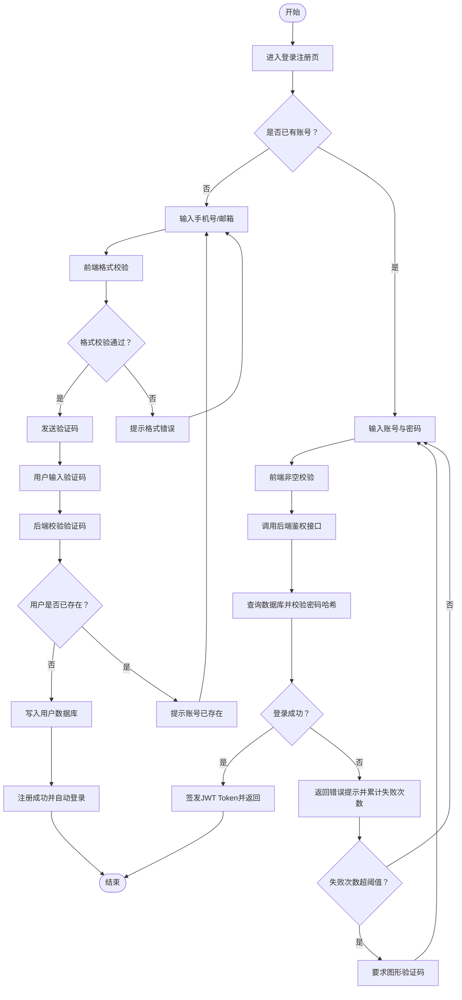

# ProcessOn Skills 使用介绍

ProcessOn 官方出品的 Claude Code Skill，用一句自然语言生成可编辑的专业图形，包括流程图、泳道图、时序图、架构图、ER 图、组织结构图、时间轴、信息图等。

- 项目地址：https://github.com/processonai/processon-skills
- 在线编辑器：https://smart.processon.com/editor
- API Key 申请：https://smart.processon.com/user

---

## 使用流程

### 1. 申请 API 令牌

访问 https://smart.processon.com/user ，新建 API 令牌，格式为 `sk-po-xxxxxxxx`。

### 2. 下载 Skill 并导入 Claude Code

从 GitHub 克隆仓库，将 `skills/processon-diagram-generator` 放入 Claude Code 的 skills 目录（默认 `~/.claude/skills/`）。

或使用一键安装：

```bash
npx skills add https://github.com/processonai/processon-skills.git \
  --skill processon-diagram-generator -g -y
```

导入成功后，在 Claude Code 中输入 `/` 可看到 `processon-diagram-generator`。


### 3. 发起指令

示例指令：

> 帮我使用 /processon-diagram-generator 这个技能 生成一个登录注册流程图，要求布局清晰，适合产品和研发沟通
> 我的 apikey 是 sk-po-xxxx

Skill 会自动完成：语义分析 → Prompt 优化 → 流式生成 Mermaid DSL → 调用渲染服务输出图片。


---

## 产物

一次调用返回三份内容。

### DSL（Mermaid 源码）

````markdown

````

纯文本，可入 Git、嵌文档、被其他工具二次解析。

### 在线编辑链接

```
https://smart.processon.com/editor
```

将 DSL 粘贴进去即可在 ProcessOn 画布上继续编辑样式、节点、泳道、配色。


### 图片预览链接

直出 PNG 直链，可贴入 PRD、PPT、IM。

```
https://ai-smart.ks3-cn-beijing.ksyuncs.com/gallery/xxxxxxxx.png
```


---

## 补充说明

- 支持图类：流程图、泳道图、时序图、软件/云架构图、ER 图、组织结构图、时间轴、信息图、金字塔图、草图重绘。
- 仅生成 DSL、不渲染图片：命令行加 `--no-render`。
- API Key 建议使用环境变量 `PROCESSON_API_KEY` 保存，避免在对话中明文暴露。
- Skill 每次运行会自动比对版本，有新版本会提示更新。
