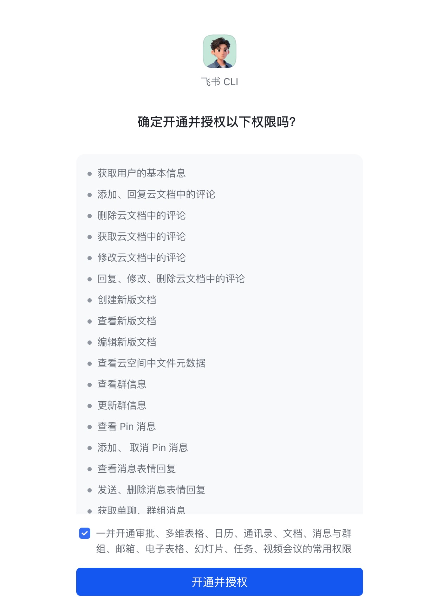
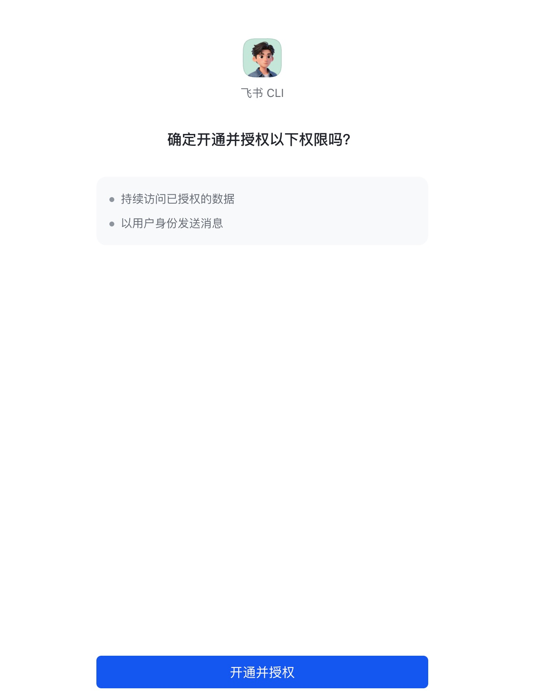

# 飞书 CLI（lark-cli）使用记录

记录一次完整的安装、授权与最常用功能（创建文档、群聊发消息）实操，含每一步的命令、返回示例与踩坑点。

> 项目地址：https://github.com/larksuite/cli

---

## 目录

- [一、安装](#一安装)
- [二、应用配置（config init）](#二应用配置config-init)
- [三、用户授权（auth login）](#三用户授权auth-login)
- [四、身份模型：user vs bot](#四身份模型user-vs-bot)
- [五、功能 1：创建飞书文档](#五功能-1创建飞书文档)
- [六、功能 2：发送消息到群聊](#六功能-2发送消息到群聊)
- [七、常见错误与排查](#七常见错误与排查)
- [八、维护操作](#八维护操作)

---

## 一、安装

向 AI Agent 直接说：

> 帮我安装飞书 CLI：https://open.feishu.cn/document/no_class/mcp-archive/feishu-cli-installation-guide.md

Agent 会按官方指南完成 CLI 安装、Skills 接入、应用配置和用户授权全流程。

---

## 二、应用配置（config init）

为 CLI 绑定一个飞书自建应用（拿到 `appId` / `appSecret`）。该命令会**阻塞等待浏览器操作**，需要在后台运行后从输出里取出验证 URL。

```bash
# 直接走「新建应用」分支
lark-cli config init --new
```

输出（截取）：

```
打开以下链接配置应用:
  https://open.feishu.cn/page/cli?user_code=XXXX-XXXX&...
等待配置应用...

OK: 应用配置成功! App ID: cli_xxxxxxxxxxxxxxxx
```

成功后该 App 的凭据已存在本地，后续命令直接用。

> ⚠️ 配置流程需要管理员/开发者权限的飞书账号在浏览器内创建应用。



---

## 三、用户授权（auth login）

### 3.1 首次授权（推荐 scope）

```bash
lark-cli auth login --recommend
```

会输出验证链接，浏览器同意后回调成功：

```
OK: 授权成功! 用户: <your_name> (ou_xxxxxxxxxxxxxxxxxxxxxxxxxxxxxxxx)
```

授权信息查看：

```bash
lark-cli auth status
```

返回示例：

```json
{
  "appId": "cli_xxxxxxxxxxxxxxxx",
  "brand": "feishu",
  "defaultAs": "auto",
  "expiresAt": "<ISO 时间, ~2 小时后>",
  "grantedAt": "<ISO 时间>",
  "identity": "user",
  "refreshExpiresAt": "<ISO 时间, ~7 天后>",
  "tokenStatus": "valid",
  "userName": "<your_name>",
  "userOpenId": "ou_xxxxxxxxxxxxxxxxxxxxxxxxxxxxxxxx"
}
```

- `expiresAt` ≈ 2 小时后；过期后自动用 refresh token 续期。
- `refreshExpiresAt` ≈ 7 天；超过需重新 `auth login`。

### 3.2 增量授权（按缺什么补什么）

`auth login` 必须指定范围：`--recommend` / `--domain <domain>` / `--scope "<scope>"`。
**多次 login 的 scope 会累积**，所以遇到 scope 缺失时按需追加最小集合即可。

```bash
# 例：首次授权时没勾选发送消息 scope，单独补一项
lark-cli auth login --scope "im:message.send_as_user"
```



---

## 四、身份模型：user vs bot

CLI 大多数操作可以用两种身份执行，效果差别非常大：

| 身份 | 标识 | Token 类型 | 适用场景 |
|---|---|---|---|
| 用户 | `--as user` | user_access_token | 访问**你本人**的资源（个人云空间、日历、邮箱、你所在的群） |
| 应用 | `--as bot` | tenant_access_token | 应用级操作；以**机器人名义**发消息、操作机器人自己的资源 |

要点：

- `defaultAs: auto` 时，CLI 会基于上下文自动选身份，**不一定是你以为的那个**，必要时显式加 `--as user/bot`。
- bot 看不到也不能代表 user 操作个人资源；user 不能让 bot 出面发消息。
- bot 发消息要求**应用已被加入目标群**。
- user 身份调用某些 API 还要再额外的 user-only scope（比如 `im:message.send_as_user`）。

---

## 五、功能 1：创建飞书文档

### 5.1 最小命令

> 实际使用：在 Claude Code 中直接说「**帮我新建一个飞书文档 内容是 test**」即可，下面是 Agent 真正执行的底层命令，仅供参考。

```bash
lark-cli docs +create --api-version v2 \
  --content '<title>test</title><p>test</p>'
```

返回：

```json
{
  "ok": true,
  "identity": "user",
  "data": {
    "document": {
      "document_id": "<doc_token>",
      "revision_id": 3,
      "url": "https://<your-domain>.feishu.cn/docx/<doc_token>"
    }
  }
}
```

### 5.2 关键参数

| 参数 | 必填 | 说明 |
|---|---|---|
| `--api-version` | 是 | 固定 `v2` |
| `--content` | 是 | XML（默认）或 Markdown 内容 |
| `--doc-format` | 否 | `xml`（默认）或 `markdown`，仅在用户明确给 Markdown 时切换 |
| `--parent-token` | 否 | 父文件夹 / 知识库节点 token |
| `--parent-position` | 否 | 如 `my_library` 表示个人知识库 |

### 5.3 内容格式

- **创建/导入**：XML 与 Markdown 都行；用户给的是 .md 或明确说 Markdown 就用 Markdown，否则默认 XML。
- **精准编辑**（`docs +update` 的局部指令）：优先 XML（block 结构稳定）。
- 标题从内容首层提取（XML 的 `<title>` 或 Markdown 的 `#`），不要在正文里再重复一次标题。

### 5.4 配套命令

```bash
lark-cli docs +fetch  --api-version v2 --doc "<URL或token>"        # 读取
lark-cli docs +update --api-version v2 --doc "<URL或token>" \
  --command append --content '<p>追加段落</p>'                       # 追加
lark-cli docs +media-insert ...                                    # 插图/插件
lark-cli drive +search ...                                         # 资源发现（电子表格/Base/文件夹等统一入口）
```

---

## 六、功能 2：发送消息到群聊

### 6.1 最简命令（user 身份发纯文本）

> 实际使用：在 Claude Code 中直接说「**帮我对 XX 群聊发个消息，内容是 …**」（把群 ID 或群名告诉它），Agent 会自动选择身份并发送。下面是底层命令，仅供参考。

```bash
lark-cli im +messages-send \
  --chat-id oc_xxxxxxxxxxxxxxxxxxxxxxxxxxxxxxxx \
  --text "test -from feishu cli"
```

成功返回：

```json
{
  "ok": true,
  "identity": "user",
  "data": {
    "chat_id": "oc_xxxxxxxxxxxxxxxxxxxxxxxxxxxxxxxx",
    "create_time": "<时间戳>",
    "message_id": "om_xxxxxxxxxxxxxxxxxxxxxxxxxxxxxxxx"
  }
}
```

### 6.2 收件人参数二选一

| 参数 | 含义 |
|---|---|
| `--chat-id oc_xxx` | 群聊 ID |
| `--user-id ou_xxx` | 私聊（对方 open_id） |

### 6.3 内容选哪个 flag

| 需求 | 推荐 flag | 备注 |
|---|---|---|
| 原文文本，保留换行/空格/反引号 | `--text "..."` 或 `--text $'...\n...'` | 直接包成 `{"text":"..."}` |
| 简单 Markdown，可接受被规范化 | `--markdown $'## 标题\n- 项'` | 自动转成 `post`，做了重排版 |
| 需要完全可控 JSON（带标题/多语言/卡片） | `--content '{"zh_cn":{"title":"...","content":[[...]]}}' --msg-type post` | 你自己保证 JSON 与 msg_type 匹配 |
| 图/文件/视频/音频 | `--image` / `--file` / `--video --video-cover` / `--audio` | 本地路径自动上传 |

互斥规则：`--text` / `--markdown` / `--content` / 媒体 flag **不能混用**；`--video` 必须配 `--video-cover`。

### 6.4 身份与 scope 的两条路径

#### 路径 A：以 user（你本人）身份发送

- 需要 scope：`im:message` + `im:message.send_as_user`
- 前提：你本人是该群成员
- 命令：
  ```bash
  lark-cli im +messages-send --as user --chat-id oc_xxx --text "..."
  ```
- 缺 scope 时增量补：
  ```bash
  lark-cli auth login --scope "im:message.send_as_user"
  ```

#### 路径 B：以 bot（应用）身份发送

- 需要 scope：`im:message` / `im:message:send_as_bot`（在飞书开发者后台开通即可，无需 `auth login`）
- 前提：**应用已被加进目标群**
- 命令：
  ```bash
  lark-cli im +messages-send --as bot --chat-id oc_xxx --text "..."
  ```

### 6.5 找群 ID

```bash
# 按群名/成员搜索可见的群
lark-cli im +chat-search --keyword "项目讨论组"
```

### 6.6 安全规则（CLI 内置）

发送消息会被他人看到，调用前必须确认：
1. 收件人是谁
2. 内容是什么
3. 用 user 还是 bot 发

---

## 七、常见错误与排查

### 7.1 `missing_scope`

```
missing required scope(s): im:message.send_as_user
```

**含义**：当前身份缺少这个 scope。
**修复**：
```bash
lark-cli auth login --scope "im:message.send_as_user"
```
（多个 scope 用空格分隔）

### 7.2 `230027 Permission denied`（user 身份发群消息）

**通常含义**：当前授权用户不是该群成员，或该 chat_id 不在你能访问的范围内。
**修复**：换一个你确实在的群 ID；或先把自己加进群。

### 7.3 `232033 ... external chats`

```
[232033] The operator or invited bots does NOT have the authority to manage external chats.
```

**含义**：目标群是**外部群（跨租户）**，应用没有「外部群操作」能力。
**修复**：
- 确认是否本意就是要发到外部群；如不是，换内部群 ID。
- 如确需操作外部群，去飞书开发者后台为该应用开启外部群相关能力，然后把应用拉进群、用 `--as bot` 发。

### 7.4 `_notice.update` 字段

任何 JSON 输出里看到 `_notice.update` 表示有新版本：
```bash
npm update -g @larksuite/cli && npx skills add larksuite/cli -g -y
# 之后退出并重启 AI Agent 才能加载新 Skills
```

---

## 八、维护操作

```bash
# 查看当前认证身份/scope/有效期
lark-cli auth status

# 增量补 scope
lark-cli auth login --scope "<scope1> <scope2>"

# 查看具体子命令帮助
lark-cli docs +create --help
lark-cli im +messages-send --help

# 在调用原生 API 前查看参数 schema
lark-cli schema im.messages.send
```

---

## 附：本次实操流水

| 步骤 | 命令 | 结果 |
|---|---|---|
| 安装 CLI + Skills | 把官方安装指南链接丢给 AI Agent | CLI 与 23 个 skill 就位 |
| 配置应用 | `lark-cli config init --new` | App ID `cli_xxxxxxxxxxxxxxxx` |
| 用户授权 | `lark-cli auth login --recommend` | tokenStatus: valid |
| 创建文档 | `lark-cli docs +create --api-version v2 --content '<title>test</title><p>test</p>'` | 返回 doc URL |
| 发消息（首次失败） | `--chat-id oc_xxx`（外部群） | `missing_scope: im:message.send_as_user` → 后又遇 `232033` 外部群限制 |
| 增量授权 | `lark-cli auth login --scope "im:message.send_as_user"` | 成功 |
| 发消息（成功） | `--chat-id oc_yyy --text "test -from feishu cli"` | 返回 message_id |
