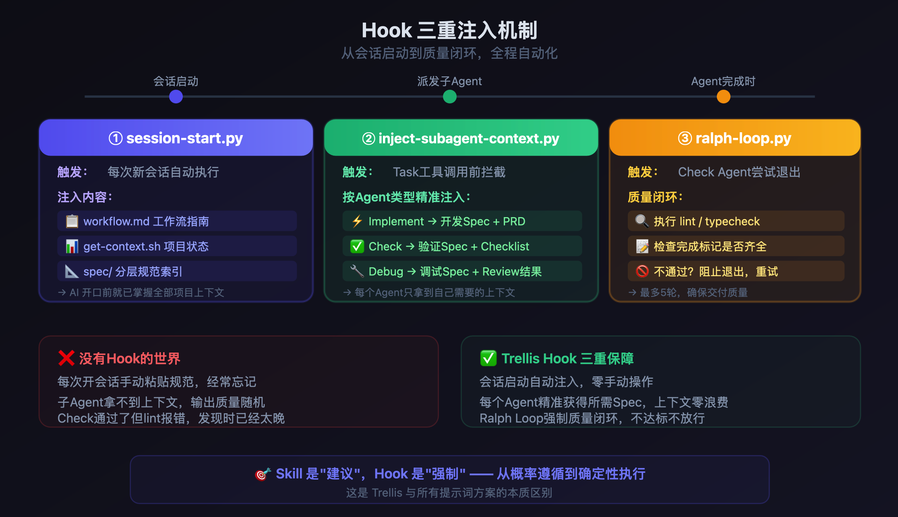
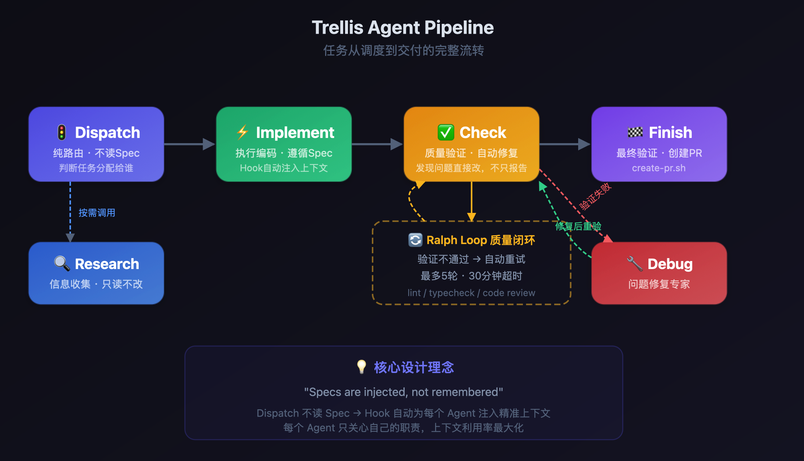
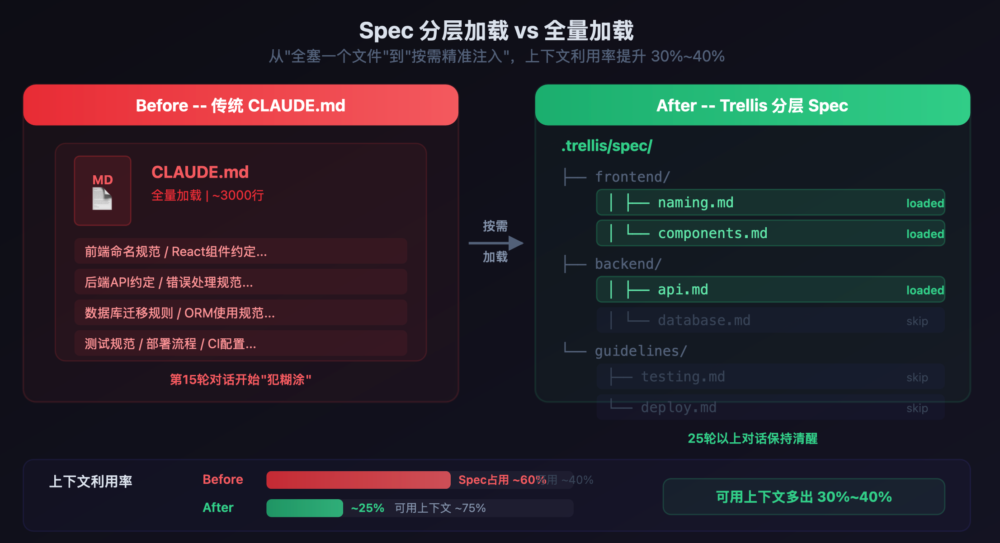
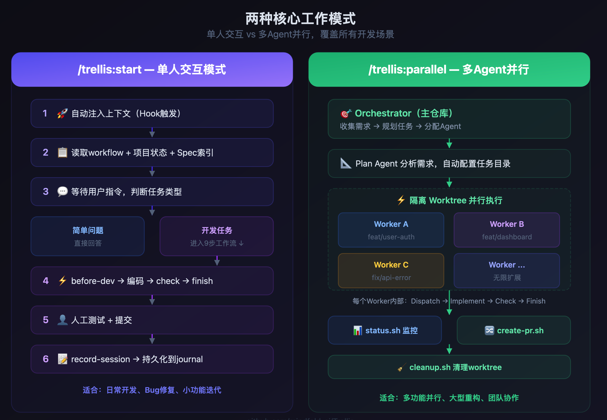

# Trellis: 一站式 AI 框架和工具集 -- 让 Claude Code 如有神助的工作流

> **作者**: @Mzs | **日期**: 2026/4/13 | **版本**: v1.0.0
>
> 基于 peek-by-cc-switch 项目实操经验 [peek-by-cc-switch](https://github.com/Mzs-code/peek-by-cc-switch)
>
> GitHub: [github.com/mindfold-ai/Trellis](https://github.com/mindfold-ai/Trellis) | 文档: [docs.trytrellis.app](https://docs.trytrellis.app)
> 
> 特别鸣谢: @helpaio 的启发和图片 [Trellis：一套让 Claude Code 如有神助的工作流](https://www.helpaio.com/guides/claude-code-workflow-trellis)
---

## 目录

- [摘要](#摘要)
- [一、问题背景: AI 编码的真实困境](#一问题背景-ai-编码的真实困境)
- [二、Trellis 是什么](#二trellis-是什么)
- [三、核心架构: 三层 Hook 系统](#三核心架构-三层-hook-系统)
- [四、四 Agent 调度模型](#四四-agent-调度模型)
- [五、Spec 规范体系: 项目的编码宪法](#五spec-规范体系-项目的编码宪法)
- [六、两种运行模式](#六两种运行模式)
- [七、实战案例: peek-by-cc-switch 项目](#七实战案例-peek-by-cc-switch-项目)
- [八、与现有方案的对比](#八与现有方案的对比)
- [九、快速上手指南](#九快速上手指南)
- [十、总结与展望](#十总结与展望)
- [附录](#附录)

---

## 摘要

Claude Code 作为当前最强大的 AI 编码 Agent, 已经彻底改变了开发者的工作方式. 然而在实际工程中, 开发者普遍面临三个核心痛点: **上下文遗忘**(对话超过 5 轮后规范被丢弃)、**指令不稳定**(修一个 bug 引入两个新 bug)、**多 Agent 协调困难**(子 Agent 不知道项目规范).

Trellis 是一个开源的 AI 编码工作流框架, 通过 **三层 Hook 自动注入**、**四 Agent 调度模型** 和 **模块化 Spec 规范体系**, 从架构层面解决了这些问题. 其核心理念是: **"规范是注入的, 不是记忆的"(Specs are injected, not remembered)**.

本白皮书基于 peek-by-cc-switch 项目的完整实操经验, 从技术架构、工作流程、实战案例三个维度, 系统阐述 Trellis 的设计哲学与落地方法.

---

## 一、问题背景: AI 编码的真实困境

### 1.1 上下文窗口的本质限制

LLM 的上下文窗口是有限的. 即使是 Claude Opus 4.6 的 200K token 窗口, 在实际工程项目中也远远不够:

- **系统提示词**占据 10-30K token
- **工具定义**(MCP、文件操作等)占据 5-15K token
- **对话历史**随轮次线性增长
- **真正留给代码上下文的空间**不断被挤压

当对话持续 15 轮以上, 早期注入的编码规范、项目约定、架构决策等关键信息会被压缩或丢弃, 导致 AI 生成的代码与项目风格渐行渐远.

### 1.2 六个真实痛点

| 痛点 | 表现 | 根因 |
|------|------|------|
| **规范遗忘** | 对话 5 轮后代码风格飘了 | 规范信息在上下文压缩中被丢弃 |
| **Bug 循环** | 修一个 bug 引入新 bug | 缺乏系统性的质量门禁机制 |
| **代码割裂** | 前后端数据结构不一致 | 跨层思考缺失, 各层独立开发 |
| **范围膨胀** | 简单需求生成上千行代码 | 没有需求拆解和复杂度评估 |
| **团队不一致** | 不同开发者产出风格各异 | 规范靠"记忆"而非"机制" |
| **会话失忆** | 新会话要重新解释上下文 | 缺乏跨会话的记忆持久化 |

这些问题的共同根因是: **AI 编码助手缺少一个结构化的工作流框架来管理上下文、规范和质量**.

### 1.3 现有方案为什么不够

在 Trellis 之前, 开发者主要依赖以下方式管理 AI 的编码行为:

- **CLAUDE.md / .cursorrules**: 单文件规范, 无法按任务类型动态加载, 项目变大后容易超出上下文限制
- **Skills**: 用户主动触发, 依赖人的记忆来选择合适的 Skill
- **手动提示**: 每次对话前手动粘贴规范, 效率低且容易遗漏

这些方案都依赖人的主动性和记忆力——恰恰是人类最不可靠的能力.

---

## 二、Trellis 是什么

### 2.1 定义与定位

Trellis 的定位是 **"AI 编码助手的脚手架系统"(Scaffolding System for AI Coding Assistants)**. 这个比喻非常精准:

> AI 的能力像藤蔓——充满活力但四处蔓延. Trellis 就是引导它沿着你的规范路径生长的脚手架.

它不是一个新的 AI 模型, 不是一个 IDE 插件, 而是一套**工作流协议和自动化工具**, 目的是让 AI 编码助手在项目的整个生命周期中保持一致的代码质量和风格.

### 2.2 核心理念

Trellis 的设计哲学浓缩为一句话:

> **"Specs are injected, not remembered."**
> 规范是注入的, 不是记忆的.

这意味着:
- 不依赖 AI "记住"项目规范
- 不依赖开发者"手动"粘贴规范
- 通过 **Hook 机制在每次 Agent 调用时自动注入**相关规范
- 注入的内容是**按任务类型动态选择**的, 而非全量加载

### 2.3 核心概念

| 概念 | 说明 | 存储位置 |
|------|------|----------|
| **Spec** | Markdown 格式的编码规范, 在实现前被读取 | `.trellis/spec/` |
| **Workspace** | 开发者会话日志, 维护跨会话记忆 | `.trellis/workspace/` |
| **Task** | 工作单元, 包含需求和上下文配置 | `.trellis/tasks/` |
| **Hook** | 自动触发脚本, 在会话开始/Agent 调用时注入上下文 | `.claude/hooks/` |
| **Agent** | 专业化 AI 子流程(Implement、Check、Debug 等角色) | `.claude/agents/` |
| **Journal** | 会话记录文件, 文档化开发活动 | `.trellis/workspace/{name}/journal-N.md` |

### 2.4 平台支持

Trellis 不仅限于 Claude Code, 目前已支持 6 个主流平台:

| 平台 | Hook 自动注入 | 手动命令 | 多 Agent |
|------|:---:|:---:|:---:|
| **Claude Code** | Yes | Yes | Yes |
| **Cursor** | - | Yes | - |
| **Codex** | - | Yes | - |
| **OpenCode** | Yes | Yes | - |
| **Kilo** | Yes | Yes | - |
| **Kiro** | Yes | Yes | - |

> Hook 和 Agent 功能目前在 Claude Code 上支持最完整. 其他平台通过手动 Slash 命令加载规范, 核心概念(Spec、Workspace、Task、Journal)跨平台通用.

---

## 三、核心架构: 三层 Hook 系统

Trellis 最精妙的设计在于其三层 Hook 自动注入架构. 这是实现"规范注入而非记忆"理念的技术基石.



### 3.1 第一层: session-start.py -- 会话初始化

**触发时机**: 每次新会话启动、上下文清空(`clear`)、上下文压缩(`compact`)

**注入内容**:
- 当前开发者身份和 Git 状态
- 完整的 workflow.md 工作流文档
- Spec 规范索引(前端/后端/指南)
- 当前活跃任务状态

**技术实现**: 通过 Claude Code 的 `SessionStart` 钩子, 将上下文包装在语义化的 XML 标签中注入:

```
<session-context> → 会话元数据
<current-state>   → Git 状态、任务列表
<workflow>         → 完整工作流
<guidelines>       → Spec 索引
```

**解决的问题**: 消除"冷启动"问题. 无论何时开始新会话, AI 都能立即获得完整的项目上下文, 无需开发者重新解释.

### 3.2 第二层: inject-subagent-context.py -- 子 Agent 上下文注入

**触发时机**: 每次调用 `Task` 或 `Agent` 工具(即派发子 Agent)之前

**注入逻辑**:
1. 读取 `.current-task` 定位当前任务目录
2. 读取任务目录中的 Agent 专属 `.jsonl` 上下文清单(如 `implement.jsonl`、`check.jsonl`)
3. 加载清单中引用的所有 Spec 文件和代码文件
4. 构建完整的提示词, 通过 `updatedInput` 覆盖子 Agent 的原始输入

**关键设计**: 上下文是**按 Agent 类型和任务类型动态组装**的:
- Implement Agent 收到前端组件规范 + 状态管理规范
- Check Agent 收到质量规范 + 错误处理规范
- Debug Agent 收到日志规范 + 错误处理规范

**解决的问题**: Dispatch Agent 保持"轻量路由器"角色, 不需要自己加载 Spec; 每个执行 Agent 只收到与其任务相关的规范, 避免上下文浪费.

### 3.3 第三层: ralph-loop.py -- 质量门禁循环

**触发时机**: Check Agent 尝试结束执行时

**验证逻辑**:
1. 如果 `worktree.yaml` 配置了 `verify` 命令(如 `pnpm lint`、`pnpm typecheck`): 程序化执行并检查通过
2. 否则: 从 `check.jsonl` 生成完成标记(如 `LINT_FINISH`、`TYPECHECK_FINISH`), 要求 Agent 输出中必须包含这些标记
3. 验证不通过则阻止 Agent 退出, 要求自行修复
4. **安全上限**: 最多 5 次迭代, 防止无限循环
5. 状态追踪在 `.ralph-state.json` 中, 30 分钟超时

**解决的问题**: 实现了自动化的"编码-检查-修复"闭环, 不需要人工介入质量验证. 这就是 Trellis 文档中提到的 **"Ralph Wiggum 技术"** -- 让 Agent 在质量门禁前反复修正, 直到通过.

---

## 四、四 Agent 调度模型

Trellis 采用职责分离的多 Agent 架构, 每个 Agent 专注于特定任务, 通过 Hook 系统获取所需上下文.



### 4.1 Agent 角色定义

| Agent | 职责 | 是否接收 Spec 注入 | 核心能力 |
|-------|------|:---:|------|
| **Dispatch** | 轻量路由器, 按 `task.json` 中的 `next_action` 数组顺序调度 | 否 | 路由决策 |
| **Research** | 分析代码库, 找到相关 Spec 和代码模式 | 否(直接读取) | 代码搜索、模式识别 |
| **Implement** | 接收注入的开发 Spec 和 PRD, 编写代码 | 是 | 代码生成、重构 |
| **Check** | 审查代码变更, 自动修复问题, 通过质量门禁 | 是 | 代码审查、自修复 |
| **Debug** | 定位和修复特定 Bug | 是 | 问题诊断、精确修复 |

### 4.2 调度流程

标准的任务执行流程:

```
用户描述需求
    ↓
Research Agent → 分析代码库, 找到相关 Spec 和代码模式
    ↓
创建 Task 目录 + PRD + 配置 .jsonl 上下文清单
    ↓
Implement Agent ← Hook 注入 Spec + PRD
    ↓
Check Agent ← Hook 注入 Spec + Ralph Loop 质量门禁
    ↓
验证通过 → 完成
```

### 4.3 上下文注入机制详解

以一个前端任务为例, `implement.jsonl` 的内容可能是:

```jsonl
{"path": ".trellis/spec/frontend/component-guidelines.md", "reason": "组件编写规范"}
{"path": ".trellis/spec/frontend/state-management.md", "reason": "状态管理模式"}
{"path": ".trellis/spec/frontend/quality-guidelines.md", "reason": "质量要求"}
{"path": ".trellis/tasks/04-13-add-delete-btn/prd.md", "reason": "需求文档"}
```

当 Implement Agent 被调用时, `inject-subagent-context.py` 会:
1. 读取这个 `.jsonl` 文件
2. 加载每个路径指向的文件内容
3. 将它们组装成结构化的提示词
4. 通过 Hook 的 `updatedInput` 注入到 Agent

这意味着 **Dispatch Agent 只需要一行简单的调度命令**, 所有繁重的上下文准备工作都由 Hook 系统自动完成.

---

## 五、Spec 规范体系: 项目的编码宪法

### 5.1 分层结构



Trellis 的 Spec 体系采用模块化的目录结构:

```
.trellis/spec/
├── frontend/                    # 前端规范
│   ├── index.md                 # 索引导航
│   ├── directory-structure.md   # 目录结构
│   ├── component-guidelines.md  # 组件规范
│   ├── hook-guidelines.md       # Hook 模式
│   ├── state-management.md      # 状态管理
│   ├── quality-guidelines.md    # 质量要求
│   └── type-safety.md           # 类型安全
├── backend/                     # 后端规范
│   ├── index.md                 # 索引导航
│   ├── directory-structure.md   # 目录结构
│   ├── database-guidelines.md   # 数据库规范
│   ├── error-handling.md        # 错误处理
│   ├── logging-guidelines.md    # 日志规范
│   └── quality-guidelines.md    # 质量要求
└── guides/                      # 思维指南
    ├── index.md                 # 索引导航
    ├── code-reuse-thinking-guide.md    # 代码复用
    └── cross-layer-thinking-guide.md   # 跨层思考
```

### 5.2 设计原则

1. **模块化而非单文件**: 每个主题一个文件, 按任务类型按需加载, 避免单个巨大的 CLAUDE.md
2. **文档化实际约定**: Spec 记录的是项目**实际在用**的约定, 而非理想化的最佳实践
3. **包含禁止模式**: 每个 Spec 不仅说明"应该怎么做", 更列出"禁止怎么做"及原因
4. **可演化**: 通过 `/trellis:update-spec` 命令, 将 bug 修复中发现的新知识反哺到 Spec

### 5.3 实战示例: peek-by-cc-switch 的 Spec

以该项目的 `frontend/quality-guidelines.md` 为例, 其核心规则包括:

| 规则 | 说明 |
|------|------|
| 零依赖策略 | 禁止 npm/任何第三方前端库 |
| 强制主题支持 | 必须使用 CSS 自定义属性, 禁止硬编码颜色值 |
| 强制 i18n | 所有用户可见文本必须通过 `t('key')` 函数 |
| 禁止 innerHTML 拼接用户数据 | XSS 防护 |
| 禁止 fetch 轮询 | 必须使用 SSE EventSource |

这些规则在每次 Implement Agent 被调用时自动注入, 确保生成的代码始终符合项目约定——即使是第 20 轮对话.

---

## 六、两种运行模式



### 6.1 /trellis:start -- 日常开发模式

这是最常用的模式, 适合日常的功能开发和 bug 修复. 完整流程:

```
会话开始 → Hook 自动注入上下文
    ↓
用户描述需求
    ↓
任务分类: 问题? 简单任务? 复杂任务?
    ↓
[复杂任务] → /trellis:brainstorm 需求梳理
    ↓
创建 Task 目录 + 写 PRD
    ↓
Research Agent 分析代码库
    ↓
配置上下文(.jsonl 文件)
    ↓
Implement Agent 编码
    ↓
Check Agent 质量检查 + 自修复
    ↓
/trellis:finish-work 提交前检查
    ↓
/trellis:record-session 记录会话
```

**任务分类机制**:

| 类型 | 判断标准 | 工作流 |
|------|----------|--------|
| **问题** | 用户询问代码/架构 | 直接回答 |
| **琐碎修复** | 拼写错误、单行修改 | 直接编辑 |
| **简单任务** | 目标明确, 1-2 个文件 | 快速确认 → 执行全流程 |
| **复杂任务** | 目标模糊, 多文件, 架构决策 | 先 Brainstorm → 再执行 |

### 6.2 /trellis:parallel -- 并行开发模式

适合多任务并行开发, 通过 Git Worktree 实现隔离:

- 每个任务在独立的 Worktree 中执行
- 每个 Worktree 有独立的 Agent 实例
- 主仓库由 Orchestrator 管理
- 完成后通过 `create-pr.py` 自动提交 PR

这种模式特别适合团队协作场景, 多个开发者(或 Agent)可以互不干扰地并行工作.

### 6.3 辅助命令矩阵

| 命令 | 用途 | 触发时机 |
|------|------|----------|
| `/trellis:before-frontend-dev` | 注入前端组件/Hook/状态 Spec | 前端任务开始前 |
| `/trellis:before-backend-dev` | 注入数据库/错误/日志 Spec | 后端任务开始前 |
| `/trellis:check-frontend` | 前端代码质量检查 | 前端代码编写后 |
| `/trellis:check-backend` | 后端代码质量检查 | 后端代码编写后 |
| `/trellis:check-cross-layer` | 跨层一致性验证 | 全栈功能开发后 |
| `/trellis:break-loop` | 深度 Bug 根因分析 | Debug 循环后 |
| `/trellis:update-spec` | 将经验反哺为 Spec | 发现新模式/修复 bug 后 |
| `/trellis:finish-work` | 提交前检查清单 | 代码完成后 |
| `/trellis:record-session` | 记录会话到 Journal | 代码提交后 |

---

## 七、实战案例: peek-by-cc-switch 项目

以下是基于 peek-by-cc-switch(一个 Claude Code/Codex 实时日志监控工具)项目的完整 Trellis 实操记录.

[peek-by-cc-switch](https://github.com/Mzs-code/peek-by-cc-switch)

### 7.1 项目概况

- **技术栈**: Python 标准库后端 + 原生 JS/CSS 前端, 零第三方依赖
- **架构**: SSE 实时推送, 浏览器端渲染
- **Trellis 版本**: 0.3.10
- **初始化日期**: 2026-04-13

### 7.2 初始化过程

**Step 1: 安装与初始化**

```bash
npm install -g @mindfoldhq/trellis@latest
trellis init -u mzs
```

Trellis 自动完成:
- 创建 `.trellis/` 完整目录结构(spec、workspace、tasks、scripts)
- 创建 `.claude/` Hook 和 Agent 配置
- 生成 15 个 Slash 命令
- 创建 Bootstrap 引导任务

**Step 2: Bootstrap 规范填充**

Trellis 自动创建了一个 `00-bootstrap-guidelines` 引导任务, AI Agent 通过分析项目代码库, 自动填充了 13 个 Spec 文件:

- 前端 6 个: 目录结构、组件规范、Hook 模式、状态管理、质量要求、类型安全
- 后端 5 个: 目录结构、数据库、错误处理、日志、质量要求
- 思维指南 2 个: 代码复用、跨层思考

每个 Spec 都是基于项目**实际代码**分析生成的, 而非通用模板.

### 7.3 功能开发实录: 会话列表删除按钮

以"给左侧会话列表添加单个删除按钮"这个需求为例, 完整记录 Trellis 工作流的执行过程.

#### 阶段一: 会话启动

执行 `/trellis:start`, 系统自动:
1. `session-start.py` 注入项目上下文(Git 状态: main 分支, 无活跃任务)
2. 加载 workflow.md 和 Spec 索引
3. 报告当前状态并询问任务

#### 阶段二: 需求分析与 Plan

用户输入: "左侧的会话列表支持单个会话的删除按钮"

AI 分类为**简单任务**, 进入 Plan 模式:
1. 启动 Explore Agent 分析代码库 -- 定位到 `renderAllSessions()`、`switchSession()`、`clearCards()` 等关键函数
2. 识别已有模式: session-item 的 CSS 样式、i18n 的 `t()` 函数、`esc()` HTML 转义
3. 产出实现方案: 4 个步骤, 2 个文件

#### 阶段三: 实现

按方案执行:

| 步骤 | 变更 | 文件 |
|------|------|------|
| 添加 i18n | `deleteSession`、`deleteBtn` 中英文 | `script.js` |
| 新增函数 | `deleteSession(sessionId)` -- 删除 session + 关联 cards + 切换处理 | `script.js` |
| 修改渲染 | `renderAllSessions()` 添加 `x` 按钮 + `stopPropagation` | `script.js` |
| 添加样式 | hover 显示、红色高亮、flex 布局 | `style.css` |

#### 阶段四: 质量检查

启动 Check Agent, 自动发现并修复 2 个问题:
1. **CSS 硬编码颜色** `#dc2626` → 替换为项目主题变量 `var(--status-err)`, 符合 `quality-guidelines.md` 中"禁止硬编码颜色"的规则
2. **Active 会话删除按钮不可见** → 添加 `.session-item.active .session-delete-btn` 规则

> 这正是 Spec 注入的价值: Check Agent 接收了 `quality-guidelines.md`, 其中明确记录了"禁止硬编码颜色值"的规则, 因此能够精确定位这个问题.

#### 阶段五: 完成与记录

1. `/trellis:finish-work` -- 通过提交前检查清单
2. `git commit` -- `feat(sidebar): 支持单个会话的删除按钮` (6a0a44b)
3. `/trellis:record-session` -- 自动记录到 `journal-1.md`, 更新 `index.md`

最终产出: **+86 行代码, -1 行修改, 2 个文件变更**, 完全符合项目零依赖、主题支持、i18n 的所有约定.

### 7.4 Workspace 跨会话记忆

Trellis 通过 Journal 系统实现跨会话记忆:

```
.trellis/workspace/mzs/
├── index.md        # 个人索引(总会话数、最后活跃时间、历史记录)
└── journal-1.md    # 会话记录(自动轮转, 单文件上限 2000 行)
```

当下次启动新会话时, `session-start.py` 会注入这些信息, 让 AI 知道"上次我们做了什么". 这解决了传统 AI 编码助手最大的痛点之一: **会话失忆**.

---

## 八、与现有方案的对比

| 维度 | .cursorrules | CLAUDE.md | Skills | **Trellis** |
|------|:---:|:---:|:---:|:---:|
| **注入方式** | 手动/每次对话 | 自动但易截断 | 用户触发 | **Hook 自动注入, 按任务动态加载** |
| **粒度** | 单个大文件 | 单个大文件 | 按 Skill 隔离 | **模块化文件, 按任务组合** |
| **跨会话记忆** | 无 | 无 | 无 | **Workspace Journal 持久化** |
| **并行开发** | 不支持 | 不支持 | 不支持 | **多 Agent Worktree 支持** |
| **质量门禁** | 无 | 无 | 无 | **Ralph Loop 自动化验证** |
| **团队协作** | 单用户 | 单用户 | 可分享但非标准化 | **Git 版本化的 Spec 库** |
| **平台支持** | Cursor 专属 | Claude Code 专属 | 平台相关 | **6 平台支持** |

Trellis 的核心优势在于: **它把"人需要记住和手动做的事"变成了"系统自动做的事"**.

---

## 九、快速上手指南

### 9.1 安装

```bash
# 全局安装
npm install -g @mindfoldhq/trellis@latest

# 在项目中初始化
cd your-project
trellis init -u your-name
```

### 9.2 初始化后的目录结构

```
your-project/
├── .trellis/
│   ├── spec/          # 编码规范(需填充)
│   ├── workspace/     # 开发者工作空间
│   ├── tasks/         # 任务管理
│   ├── scripts/       # 自动化脚本
│   ├── config.yaml    # 项目配置
│   └── workflow.md    # 工作流文档
├── .claude/
│   ├── hooks/         # Hook 脚本(Claude Code)
│   ├── agents/        # Agent 定义
│   └── commands/      # Slash 命令
└── ... (你的项目代码)
```

### 9.3 第一个任务

```bash
# 1. 启动会话(Claude Code 中)
/trellis:start

# 2. 描述你的需求
"给用户列表添加搜索功能"

# 3. AI 会自动:
#    - 分析代码库(Research Agent)
#    - 创建任务目录和 PRD
#    - 配置上下文(.jsonl)
#    - 编写代码(Implement Agent)
#    - 质量检查(Check Agent)

# 4. 完成后
/trellis:finish-work    # 提交前检查
git commit              # 人工提交
/trellis:record-session # 记录会话
```

### 9.4 配置建议

**`config.yaml`** -- 项目级配置:
```yaml
session_commit_message: "chore: record journal"
max_journal_lines: 2000
```

**`worktree.yaml`** -- 质量门禁配置:
```yaml
verify:
  - pnpm lint
  - pnpm typecheck
```

> 配置 `verify` 后, Ralph Loop 会在 Check Agent 退出前程序化执行这些命令, 确保代码通过所有静态检查.

---

## 十、总结与展望

### 10.1 核心观点

1. **AI 编码的瓶颈不是模型能力, 而是上下文管理**. Claude Opus 4.6 足够聪明, 但如果不给它正确的上下文, 它也无法写出符合项目规范的代码.

2. **"注入而非记忆"是正确的工程策略**. 依赖 AI 的"记忆"来保持代码一致性是不可靠的. Trellis 的 Hook 注入机制从架构层面解决了这个问题.

3. **Spec 是项目的核心资产**. 好的 Spec 不仅指导 AI, 也是团队知识的结构化沉淀. 通过 Trellis, Spec 从"被动文档"变成了"主动注入的编码宪法".

4. **质量门禁必须自动化**. Ralph Loop 证明了: 只要给 Agent 明确的质量标准和自修复的机会, 它能够在无人干预的情况下达到生产级代码质量.

5. **工作流 > 工具**. Trellis 不是一个新的 AI 工具, 而是一套让现有 AI 工具发挥最大效能的工作流框架. 工具会变, 但好的工作流方法论是持久的.

### 10.2 适用场景

| 场景 | 推荐程度 | 说明 |
|------|:---:|------|
| 中大型项目 | 强烈推荐 | Spec 体系的价值在项目复杂度上升时指数增长 |
| 团队协作 | 强烈推荐 | Git 版本化的 Spec 确保团队一致性 |
| 长期维护项目 | 推荐 | Journal 系统提供跨会话记忆 |
| 个人小项目 | 可选 | 初始化成本有一定开销, 但 Spec 沉淀长期受益 |

### 10.3 展望

Trellis 代表了 AI 编码工具的一个重要发展方向: **从"对话式编码"到"工程化编码"**. 随着 AI 模型能力的持续提升, 限制 AI 编码效能的瓶颈将越来越多地从"模型不够聪明"转向"上下文管理不够好". Trellis 的三层 Hook 架构和 Spec 注入理念, 为这个方向提供了一个可行且经过实战验证的解决方案.

---

## 附录

### 术语表

| 术语 | 说明 |
|------|------|
| Trellis | AI 编码工作流框架, 意为"格子架/脚手架" |
| Spec | Specification, 模块化的编码规范文件 |
| Hook | Claude Code 的钩子机制, 在特定事件时自动执行脚本 |
| Ralph Loop | 基于"Ralph Wiggum 技术"的自动化质量门禁循环 |
| PRD | Product Requirements Document, 产品需求文档 |
| Journal | 会话记录文件, 实现跨会话记忆 |
| Worktree | Git 工作树, 用于并行开发的隔离环境 |
| JSONL | JSON Lines, 每行一个 JSON 对象的上下文清单格式 |
| SSE | Server-Sent Events, 服务端推送事件协议 |
| Dispatch Agent | 轻量路由 Agent, 负责任务调度 |
| Implement Agent | 代码实现 Agent |
| Check Agent | 代码审查和自修复 Agent |
| Research Agent | 代码库分析 Agent |

### 参考资源

- [Trellis 官方文档](https://docs.trytrellis.app/zh/guide/ch01-what-is-trellis) -- 完整的使用指南
- [Trellis GitHub](https://github.com/mindfold-ai/Trellis) -- 开源仓库
- [Trellis 技术解析文章](https://www.helpaio.com/guides/claude-code-workflow-trellis) -- 架构深度分析
- [Effective Harnesses for Long-Running Agents](https://www.anthropic.com/engineering/effective-harnesses-for-long-running-agents) -- Anthropic 官方工程博客, Trellis 的理论基础
- [Claude Code 官方文档](https://docs.anthropic.com/en/docs/claude-code) -- Claude Code 使用指南
- [peek-by-cc-switch](https://github.com/Mzs-code/peek-by-cc-switch) -- 本白皮书实操项目
